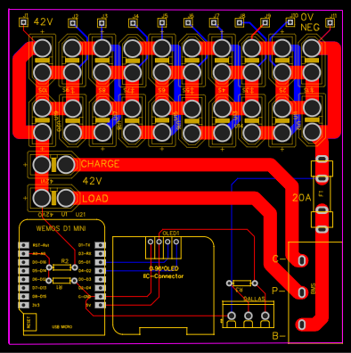

# BMS (Battery Management System)

Ce projet est un système de gestion de batterie (BMS) pour une batterie Li-ion. Il utilise une carte de contrôle avec les fonctionnalités suivantes :

- **Afficheur OLED** : Pour afficher les informations de la batterie en temps réel.
- **Sonde Dallas** : Pour mesurer la température de la batterie.
- **Mesure de tension** : Pour surveiller la tension de la batterie.
- **MQTT** : Pour envoyer les données vers Home Assistant à terme.

## Fonctionnalités

- Surveillance de la tension de la batterie.
- Surveillance de la température de la batterie.
- Affichage des informations sur un écran OLED.
- Envoi des données vers Home Assistant via MQTT (à venir).

## Installation

1. Clonez ce dépôt.
2. Ouvrez le projet avec PlatformIO.
3. Compilez et téléversez le code sur votre carte de contrôle.

## Utilisation

Une fois le code téléversé, le système commencera à surveiller la batterie et à afficher les informations sur l'écran OLED. Les fonctionnalités MQTT seront ajoutées dans une future mise à jour.

## Contributions

Les contributions sont les bienvenues. Veuillez soumettre une pull request pour toute amélioration ou correction.

## Licence

Ce projet est sous licence MIT. Voir le fichier [LICENSE](LICENSE) pour plus de détails.

## TODO 

- Codage de la partie Web pour le reglage du pont diviseur, à voir si c'est vraiment utile

## carte pour la batterie 

La carte est prévue pour une batterie Li-ion pour un équivalent 10S ( 42V )
chaque groupe de cellule 4.2V est branchée sur un connecteur XT60 et je vais utiliser des support 8P trouvable sur Aliexpress 
La raison de ce choix est pour pouvoir facilement changer les cellules en cas de problèmes et avoir un état possible du groupe de cellule pour connaitre l'équilibrage
( >> mot clé : Support de batterie 8x18650 )

Le BMS à brancher dessus est de type 3 voies facilement trouvable sur Aliexpress 
( >>>> BMS 40A 10s )

La sonde de température est de type dallas 18b20 
L'afficheur Oled est de type 64*128 0.96 pouce

L'ensemble sera branché par la suite sur un micro Onduleur type Enphase M215 commandée par une prise connectée. 
